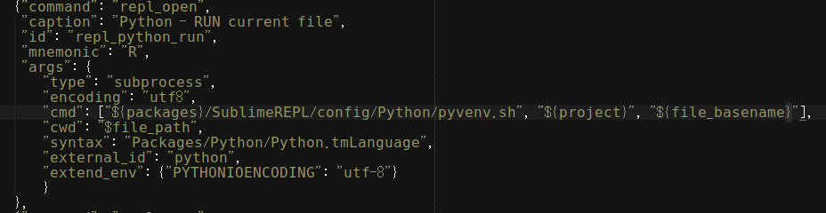
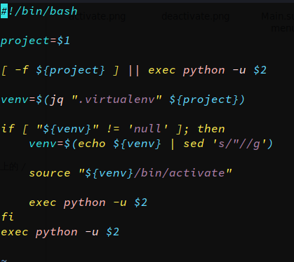

# sublimetext3 + virtualenv + sublimerepl
默认情况下SublimeREPL使用操作系统下的python解释器。并非我们在Sublime Text3中激活的Python环境。
在此记录SublimeREPL的配置。
**该方法采用获取项目名称和项目配置文件中的'virtualenv‘ key,相比其它方案灵活。**
**说明：操作系统manjaro Linux 18**

## 前提条件：
>		1:安装有virtualenv插件
>		2:必须,必须，必须,使用项目方式管理(project)
>		3:操作系统必须安装jq(json解释工具)

## 效果:

## 配置:
####sublimerepl配置
>		打开sublimerepl配置目录(sublime-text-3/Packages/SublimeREPL/config/Python/)，编辑Main.sublime-menu。修改其中id为：repl_python_run下的cmd，将内容修改为：cmd: [${packages}/SublimeREPL/config/Python/pyvenv.sh", "$project_path", "$project_name", "$file_basename"]
**参数说明：**
`pyvenv.sh`脚本:	自己创建的脚本，并符执行权，脚本内容见下文
`project_path`变量:	项目路径
`project_name`变量:	项目名称
`file_basename`变量:	需要被执行的程序文件

>		**注意:**默认情况下，sublimeREPL不会传递project_path，project_name变量。需配置"use_build_system_hack": true

**Main.sublime-menu:**

**用户sublimeREPL配置:**

**pyvenv.sh脚本:**

